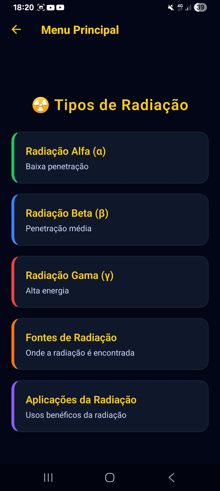

# Projeto Expo: Mundo da Radioatividade

Este projeto é um aplicativo móvel desenvolvido com Expo e React Native que explora o tema da radioatividade, seus tipos, fontes e aplicações.

## Telas Implementadas

*   **Tela Inicial:** Apresenta uma introdução ao mundo da radioatividade.
*   **Tipos de Radiação:** Detalha os tipos de radiação (Alfa, Beta, Gama).
*   **Fontes de Radiação:** Explora as fontes naturais e artificiais de radiação.
*   **Aplicações da Radiação:** Aborda os usos benéficos da radiação em diversas áreas.

## Como Executar o Projeto

1.  **Clone o repositório:**
    ```bash
    git clone https://github.com/SEU_USUARIO_GITHUB/NOME_DO_REPOSITORIO.git
    cd NOME_DO_REPOSITORIO
    ```
2.  **Instale as dependências:**
    ```bash
    npm install
    ```
3.  **Inicie o servidor de desenvolvimento:**
    ```bash
    npm start
    ```
4.  **Abra no Expo Go:** Escaneie o QR code exibido no terminal com o aplicativo Expo Go no seu celular, ou execute em um emulador/simulador.

## Geração do APK (Opcional )

Para gerar um APK instalável, siga as instruções do documento `report_theory.md` e utilize o EAS Build.

## Prints das Telas

## Prints das Telas



